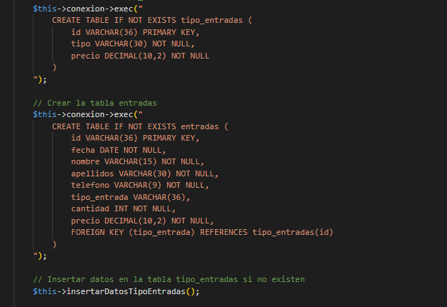
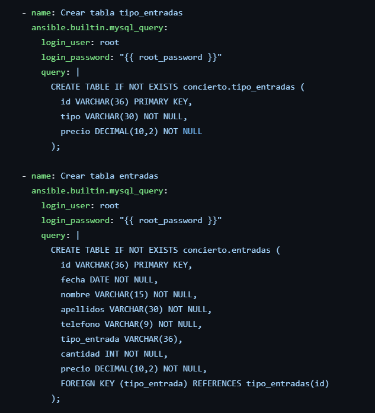
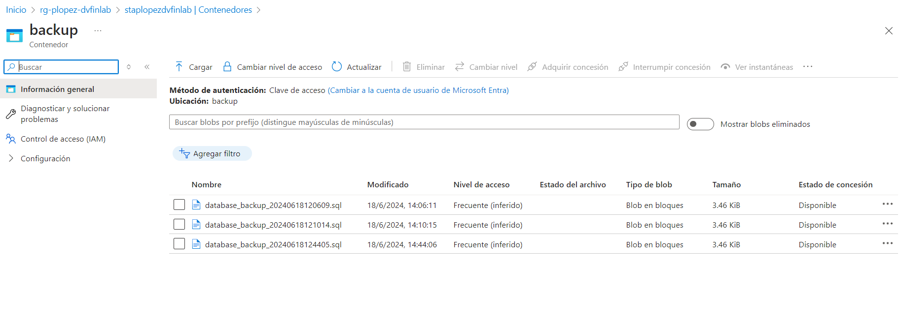

Para la creacion de la base de datos, dentro de la aplicacion de PHP en model/bdmodel.php , 
una vez establecida la conexión con el contenedor/máquina virtual que contiene mysql, se proceden 
a crear las tablas mediante funciones en la propia clase del archivo
        
        

con la última llamada a la funcion, se insertan los datos de los diferentes tipos de entradas disponibles

Posteriormente, cuando despliego ansible desde la máquina virtual 2 y creo la base de datos dentro de la máquina virtual 1,
también se procede a la creación de la base de datos mediante comandos en ansible, esto ocurre ya que cuando se desarrolla
el proyecto y se procede a desplegar ansible.

        

ASí se vería la tabla de entradas (ya con los datos en la base de datos) desde la aplicación PHP

        

Y posteriormente se añadieron dos nuevas funcionalidades, la de crear un backup de la bbdd, dentro de un contenedor 
en Azure, lo que permite, tener una copia de seguridad en caso de fallo . Esto se llevó a cabo con un workflow de Github
Actions, conectado a un self hosted runner que se establece en la máquina virtual 2, y ejecuta el comando mysql dump para
generar un archivo partiendo de mysql, copiarlo y guardarlo en un contenedor en el storage account de Azure

        

Este archivo se obtiene gracias aa un workflow que se lanza mediante un cronjob (un trabajo definido a realizarse en un 
determinado momento), en este caso,  establecido a las 12:15 de la mañana todos los dias,semanas, meses, etc... 

La otra funcionalidad es la recuperación ante desastres, mediante el uso de la operación inversa a la anterior, al tener 
una copia de seguridad de los datos y la aparición de cualquier circusntancia adversa que obligue a la destrucción de 
nuestra bbdd, o corrupción de su contenido, tenemos un workflow en github actions que permite extraer la última copia de 
seguridad de los datos de nuestra base de datos y teniendo en una máquina Mysql poder seguir trabajando con ellos 
 